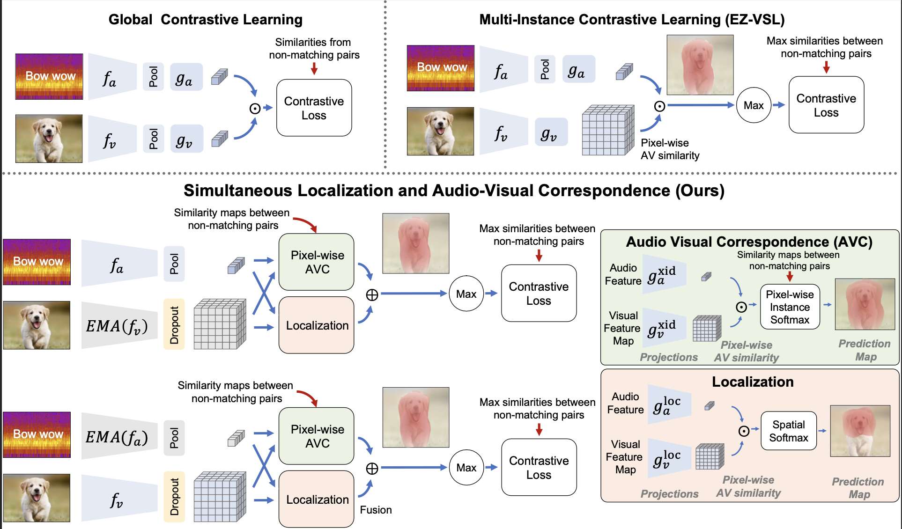

# Tackling Overfitting and Silence in Weakly-Supervised Audio-Visual Source Localization

Official codebase for SLAVC. 

SLAVC is a new approach for weakly-supervised visual sound source localization to identify negatives and solve significant overfitting problems.

<div align="center">
  
</div>


## Environment

To setup the environment, please simply run

```
pip install -r requirements.txt
```

## Datasets

###  Flickr-SoundNet

Data can be downloaded from [Learning to localize sound sources](https://github.com/ardasnck/learning_to_localize_sound_source)

###  VGG-Sound Source

Data can be downloaded from [Localizing Visual Sounds the Hard Way](https://github.com/hche11/Localizing-Visual-Sounds-the-Hard-Way)

###  Extended Flickr-SoundNet

Data can be downloaded from [Extended-Flickr-SoundNet](https://drive.google.com/file/d/1Z7mtXpml0gj2qUEIhFjWvBRryk4DRXot/view?usp=sharing)


###  Extended VGG-Sound Source

Data can be downloaded from [Extended-VGG-Sound Source](https://drive.google.com/file/d/1dcaSyJ8xyfCPKmESDLyKucglm-1ROEOt/view?usp=sharing)


## Model Zoo

We release MoVSL model pre-trained on VGG-Sound 144k data and scripts on reproducing results on Extended Flickr-SoundNet and Extended VGG-Sound Source benchmarks.

| Method |    Train Set   |     Test Set    |     AP     |  max-F1  |  Precision  | url | Train | Test |
|:------:|:--------------:|:---------------:|:------------:|:-----:|:-----:|:---:|:----:|:----:| 
| MoVSL | VGG-Sound 144k | Extended Flickr-SoundNet |     51.63    | 59.10 | 83.60 | [model](https://drive.google.com/file/d/1wHufeLWZBv97IaE0cv0GrFk4pLX5NMUj/view?usp=sharing) | [script](./scripts/train_vggsound144k.sh) | [script](./scripts/test_extended_flickr_with_vggsound144k.sh) |
| MoVSL | VGG-Sound 144k | Extended VGG-SS |     32.95    | 40.00 | 37.79| [model](https://drive.google.com/file/d/1wHufeLWZBv97IaE0cv0GrFk4pLX5NMUj/view?usp=sharing) | [script](./scripts/train_vggsound144k.sh) | [script](./scripts/test_extended_vggss_with_vggsound144k.sh) |

## Train

For training an SLAVC model, please run

```
python train.py --multiprocessing_distributed \
    --train_data_path /path/to/VGGSound-all/ \
    --test_data_path /path/to/Flickr-SoundNet/ \
    --test_gt_path /path/to/Flickr-SoundNet/Annotations/ \
    --experiment_name vggss144k_movsl \
    --model 'movsl' \
    --trainset 'vggss_144k' \
    --testset 'flickr' \
    --epochs 20 \
    --batch_size 128 \
    --init_lr 0.0001 \
    --use_momentum --use_mom_eval \
    --m_img 0.999 --m_aud 0.999 \
    --dropout_img 0.9 --dropout_aud 0
```

## Test

For testing and visualization, simply run

```
python test.py --test_data_path /path/to/Extended-VGGSound-test/ \
    --model_dir checkpoints \
    --experiment_name vggss144k_movsl \
    --testset 'vggss_plus_silent' \
    --alpha 0.9
```
